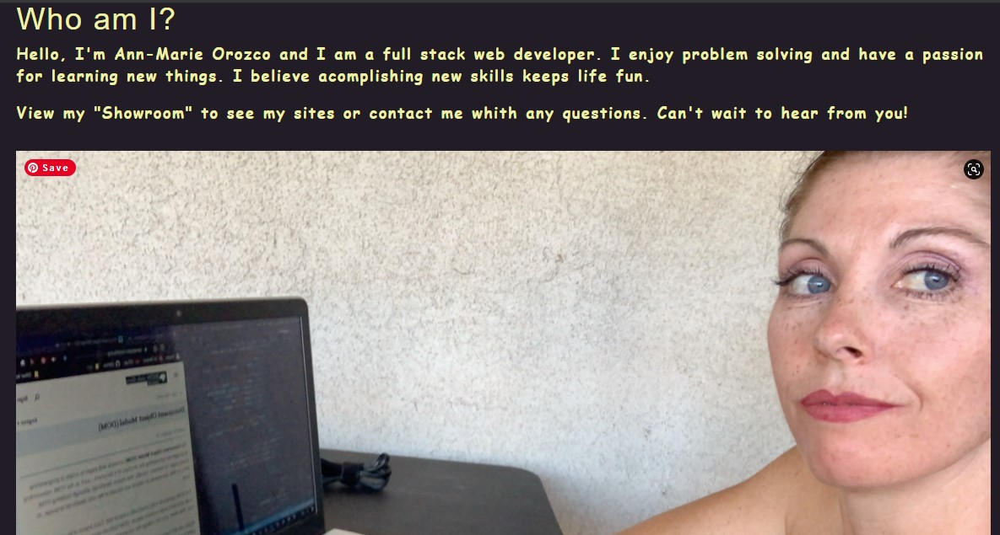

# My Developer React Portfolio
This project was bootstrapped with [Create React App](https://github.com/facebook/create-react-app).

## Deascription
Create a portfolio website to display my projects.

## Screenshots

## Website
"http://ann760.github.io/developer-portfolio"

## Author
* [Ann-Marie Orozco](ann760.github.io/myportfolio/) follow the link to see my portfilo website

## Available Scripts
### `npm start`
Runs the app in the development mode.\
Open [http://localhost:3000](http://localhost:3000) to view it in your browser.

The page will reload when you make changes.\
You may also see any lint errors in the console.

if another process is running kill it
cmd "/C TASKKILL /IM node.exe /F"

### `npm run build`
Builds the app for production to the `build` folder.\
It correctly bundles React in production mode and optimizes the build for the best performance.

### `npm run deploy`
Deploys the app for production
